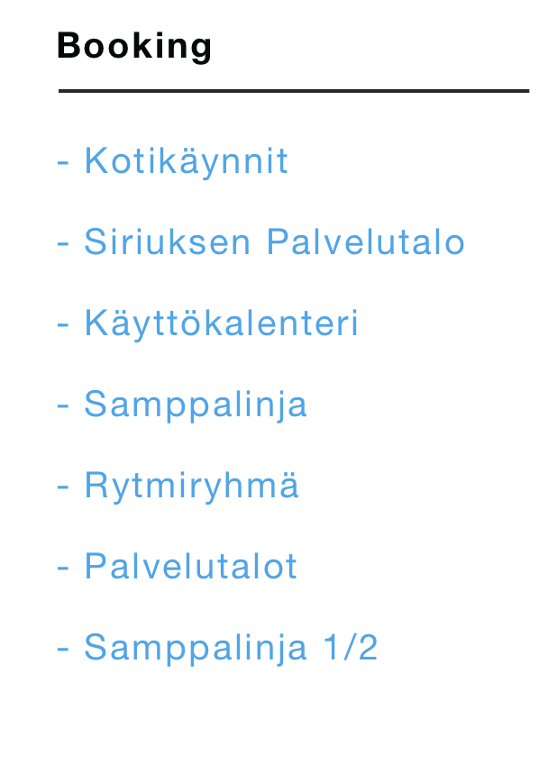
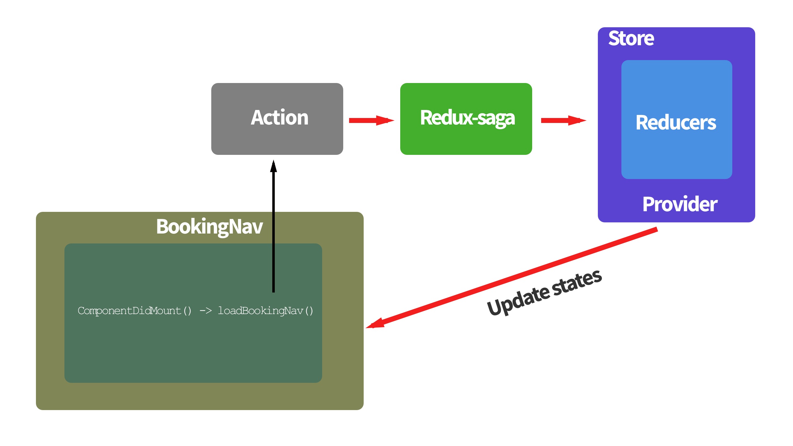

# Getting started

The architecture of Domacare2.0 is based on a react-boilerplate. The introduction of react-boilerplate is a good read if you don't have previous knowledge on ReactJS + Redux project.

There are many well-written articles on ReactJS and Redux. React applicatons are build using UI components. UI Components can be `stateful/container` or `stateless/dummy`. In Domacare2.0 app some UI component do have it's own route; we call them **feature** component. In this section, I will mainly focus on explaining how to create an new React stateful/container component. The component we'are going to create is **BookingNav** without it's own route. **BookingNav** component will show list of all units which belongs to a Booking timeline.

## BookingNav component



## Workflow

Let's try to understand the stateful container component workflow before we start writing codes.

- When BookingNav component is mounted `componentDidMount` event will dispatch `loadBookingNav` action.
- `loadBookingNav` is dispatched through a function declared in `mapDispatchToProps`.
- A `bookingNavSagaWatcher` sees the action `LOAD_BOOKINGNAV` and trigger `bookingNavSagaWorker`.
- `bookingNavSagaWorker` performs `yield call` API side-effect, fetches data and dispatch an actions to indicate `yield call` result. If successful (`LOAD_BOOKINGNAV_SUCCESS`) action is dispatch with `timetabs` data and updates `reducers states` accordingly. If an error (`LOAD_BOOKINGNAV_FAILED`), we will send an `error` object.
- `mapStateToProps` will make `timetabs` redux state available as a `props` in the BookingNav component. Notice we don't provide `timetabs` **state** straight to the component, instead we're using `selectors.js`. The benefits of `selector` are **computation**, **memoization** and **composability**. Once we get **timetabs** as a `props` we can loop `this.props.timetabs` and render list of `units`.





## Getting started

There are two approaches you can create BookingNav component: 1) react-boilerplate PLOP generator and 2) manually creating all necessary files. For simplicity I will go with manual approach and create BookingNav folder inside sharedComponents. For more information please take a look at **Folder structure** documentation.

1. `cd Domacare2.0/src/sharedComponents`
2. `mkdir BookingNav && cd BookingNav`
2. `touch index.js && touch actions.js && touch api.js && touch constants.js && touch reducer.js && touch sagas.js`


**index.js**


```
import React from 'react';
import PropTypes from 'prop-types';
import { connect } from 'react-redux';
import { bindActionCreators } from 'redux';
import { createStructuredSelector } from 'reselect';

import {Row, Col } from 'react-bootstrap';

import { loadTimetabs } from './actions';
import { BookingUnitsSelector } from './selectors';

import Spinner from '../sharedComponents/Spinner';

class BookingNav extends React.PureComponent {

  // loadBooking once component is mounted
  componentDidMount() {
	this.props.loadBookingNav();
  }

  render() {
    const { timetabs} = this.props;
    return (
      <div>
        <Row>
          <Col>
            <ul>
              {timetabs ? timetabs.map(unit => (
                  <li
                    key={unit.id}
                    >
                    <span>{unit.name}</span>
                  </li>
              ))
              : <Spinner />
            }
          </ul>
        </Col>
      </Row>
    </div>

    );
  }
}


BookingNav.propTypes = {
  timetabs: PropTypes.oneOfType([
    PropTypes.object,
    PropTypes.arrayOf(
      PropTypes.shape({
        id: PropTypes.number.isRequired,
        name: PropTypes.string.isRequired,
        color: PropTypes.string.isRequired,
      }).isRequired,
    ),
  ]),
}


const mapStateToProps = createStructuredSelector({
  timetabs: BookingUnitsSelector(),
});

const mapDispatchToProps = (dispatch) => {
  return {
    loadBookingNav: bindActionCreators(loadBookingNav, dispatch),

  };
};

export default connect(mapStateToProps, mapDispatchToProps)(BookingNav);
```


**constants.js**

```
export const LOAD_BOOKINGNAV = 'app/booking/LOAD_BOOKINGNAV';
export const LOAD_BOOKINGNAV_SUCCESS = 'app/booking/LOAD_BOOKINGNAV_SUCCESS';
export const LOAD_BOOKINGNAV_FAILED = 'app/booking/LOAD_BOOKINGNAV_FAILED';
```

**actions.js**

```
import {
  LOAD_BOOKINGNAV,
  LOAD_BOOKINGNAV_SUCCESS,
  LOAD_BOOKINGNAV_FAILED,

} from './constants';

export function loadTimetabs() {
  return {
    type: LOAD_BOOKINGNAV,
  };
}

export function timetabsLoaded(timetab) {
  return {
    type: LOAD_BOOKINGNAV_SUCCESS,
    timetab,
  };
}

export function timetabsLoadFailed(error) {
  return {
    type: LOAD_BOOKINGNAV_FAILED,
    error,
  };
}

```

**reducer.js**

```
import { fromJS } from 'immutable';
import {
  LOAD_BOOKINGNAV,
  LOAD_BOOKINGNAV_SUCCESS,
  LOAD_BOOKINGNAV_FAILED,
  }
from './constants';

const initialState = fromJS({
  timetabs: [],
});

// BookingNav reducer


function bookingNavReducer(state = initialState, action) {
  switch (action.type) {
    case LOAD_BOOKINGNAV:
      return state;

    case LOAD_BOOKINGNAV_SUCCESS:
      return state.set('timetabs', action.timetabs);

    case LOAD_BOOKINGNAV_FAILED:
      return state.set('error', fromJS(action.error))

 	default:
      return state;
  	}
}

export default bookingNavReducer;
```

**saga.js**

```
import { takeEvery, call, put } from 'redux-saga/effects';

import {
  LOAD_BOOKINGNAV,
  LOAD_BOOKINGNAV_SUCCESS,
  LOAD_BOOKINGNAV_FAILED,
 } from './constants';

import { getBookingUnitAPI as getTimetabs } from api.js;

// worker
export function* bookingNavSagaWorker() {
  try {
    const requestunits = yield call(getTimetabs);

    // get only three unit fields (id, name, color) from api response
    const timetabs = requestunits.map(({ id, name, color }) => ({
      id,
      name,
      color,
    }));

    if (timetabs) {
      yield put({ type: LOAD_BOOKINGNAV_SUCCESS, timetabs });
    }

  } catch (errormsg) {
    yield put({ type: LOAD_BOOKINGNAV_FAILED, errormsg });
  }
}


// watcher
export function* bookingNavWatcher() {
  yield takeEvery(LOAD_BOOKINGNAV, bookingNavSagaWorker);
}


export default [
  bookingNavWatcher,
];
```

**api.js**

```
import request_super from '../../utils/api/request_super';
import { reqHeaders } from '../utils/api/headers';

const url = process.env.CONFIG.apiUrl;

export const getBookingUnitAPI = () => request(`${url}/booking/timetabs`, reqHeaders);
```

**selector.js**

```
import { createSelector } from 'reselect';
const selectBookingDomain = () => (state) => state.get('booking');

const BookingUnitsSelector = () => createSelector(
  selectBookingDomain(),
  (timetabs) => timetabs.get('timetabs')
);

export default selectBookingDomain;
export {
  BookingUnitsSelector,
};
```

[Back to Main Documentation Page] (../README.md)
