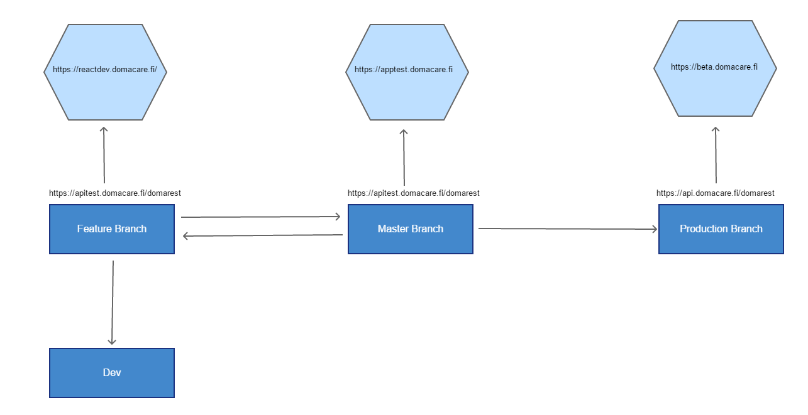

# Git Workflow

## API, Branch, Staging and Production Servers
We have different APIs for different Environments
- Dev: https://apidev.domacare.fi/domarest
- staging: https://apitest.domacare.fi/domarest
- Production: https://api.domacare.fi/domarest

Since these APIs can be at different level, it is always a good idea to confirm that the end point used in the feature branch is available at production before we push feature branch to the production. Please note that we are using `apitest` in the development instead of `apidev` and only use the `apidev` when it is needed to test the endpoint before backend guys merge it to staging.

The app can be seen live at three different servers. These servers represents three different stages of app development.
- https://reactdev.domacare.fi/
- https://apptest.domacare.fi/
- https://beta.domacare.fi/

  Jenkin link to build this branches are available at https://jenkins.domacare.fi. You will need the access from admin to use it. We are using demo database in all three servers and we will see the same data in all three servers, if we login with our development credentials.
  Other then beta.domacare.fi, the access to the servers are restricted and requires viscosity VPN.

## Git Worflow

1. We start working by creating feature or hotfix branch from Master.
2. We push the feature branch changes on at least daily basis to the dev branch. The dev branch serves as the integration testing ground for everyone.
3. After completing the work on feature branch, build it by using Jenkin for preliminary test and approval for production. It will be available at https://reactdev.domacare.fi/. The guide to build the Jenkin is available [here](build.md)
4. Once approved to be published, push the it to the master and build it in Jenkin. It will be available at https://apptest.domacare.fi/.
5. After testing the feature branch in apptest, after approval, push the changes to the production branch.

### Points to remember about Git
- Always create a separate branch from master for whatever feature or bug fixes you are working on.
- Never make any changes directly in master unless you are sure it can be available at the production.
- Keep the feature branch up to date with master.
- Push the code to dev branch at the end of everyday.
- Master will be at the same level as production.
- Test the feature branch in reactdev and get approval to publish before merging with master.

[Back to Main Documentation Page] (../README.md)
