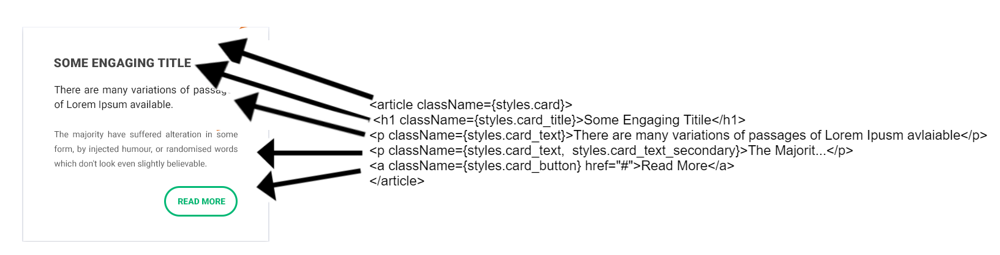

# CSS
---
 The goal of these guidelines is to make the CSS used in DomaCare2.0 predictable, scalable and maintainable.


## The problems we are trying to avoid

1.	Specificity problem.
2.	Nested selectors are slower (debatable).
3.	Reduce unused style sheets.
4.	Reduce file size.
5.  Less use of `!Important`.

Although some problems of CSS specificity is solved since we are using css-modules but these guidelines are still good to follow in case we move away from css-modules. We gathered the best practices by taking out good points from OOCSS and BEM models.

**Remember that component, objects and modules are synonymous to each other. Example of objects are buttons, section header**

**Good read `https://smacss.com/book`**

## Best Practices

1. **Decouple CSS selectors**

    Don’t use nested selectors because it makes the CSS coupled with the HTML structure.

    For example

    ```
    #warpper a h1 {
    	Color: green;
    }
    ```

     If we change the position of h1 element in the HTML, we will need to change the above styles too since they are done by using descendent selectors. If we would have used flat hierarchy, we would not have to worry about the styles.


2.	**Single responsibility**

    In React we are defining styles of components in their respected folders, so they are somewhat already modular but even in these components we have sections which can get benefit from this rule. Within components there are part of UI elements which are not reusable and present only in that component. We can call it inner Modules or objects. Single responsibility will make sure they inner modules reusable.

    Every module or object can be divided into three parts

    1. Main module or object (Main reusable module)
    2. Child (They are parts of module such as module title)
    3. Modifier (It modifies the module or child)

    For example, we can think of a post module in some blog post. Consider it is not used anywhere else in he app. The classes for post module could be
    ```
    .post (Module)
    .post_title (child)
    .post__primary (modifier)
    .post_title__primary (child modifier)
    ```
    A complete example of it along with other is presented at the bottom. Not the double underscore __ with the modifier selector. That helps in differentiating the modifier classes with other classes.

3.	**Separation of structure from skin (OOCSS Principle)**

     Separating structure and skin demands that our CSS classes be either responsible for structure or skin, but not both. For example, Structure will be what makes a button looks like a button and skin will be color of it

    `Structure`
    ```
    .bttn
    {
       Border-radius: 4px;
       display: inline-block;
       font-size: 1.25 em;
       padding : 1em			
    }
    ```

    `Skin`
    ```
    .bttn_primary {background : blue}
    .bttn_success {background : blue}
    .bttn_warning {background : orange}
    ```

    We can use that in any element

    ```
    <a className= `${styles.bttn} ${styles.bttn_primary}`  href=”#”> </a>
    <span className= `${bttn} ${bttn_sucess}` href=”#”> </a>
    ```

4.	**Separation of container from content (OOCSS Principle)**

    No need to constrain the style of an element (the content) to the its context (the container).

    Wrong way. Location dependent styles  
    ```
    .categoryList h2 {
       //styles
    }

    .footer h2 {
       //same styles copied from above
    }
    ```

    Here the container is `.footer` and `.categoryList` and content is `h2`. We can separate the `h2` from `.footer` and `.categoryList` and give its style some class name such `.section_header`.

5.	**Use id’s for main layout and single use cases such as #header, #wrapper**

    The best candidates for ID selectors are layout elements such as #warpper. You don't need to use id's since we already have main layout ready which used the Id's. That means you will always need to use classes.

6.	**Use CSS classes all the time**

    This will assure the reusability of the modules. For example, the bellow is a bad choice. Also ID's are hard to overwrite. It is Ok to use ID selectors for bigger constant layout elements such as #header, #footer etc. but for others classes only.

    ```
    .modal
    .modal_body
    .modal_toolbar
    ```


7. **Don’t use nested selectors.**
   The reason for this is explained in **Decouple CSS selectors** section above that they coupled the CSS with HTML.


8. **Don’t use CSS selectors just for the JavaScript**, we can use `data-` attributes instead.


## Organization of styles we have

1.	`global.scss`
    contains the global element declarations such as h1, h2, p etc. It also    contains global typographical styles. You guys usually will not need to update it since the major global styles are already defined based on our designed guidelines unless something is missing from it.

2. `layout.scss`
    contains major layout styles such as structural, header and wrapper. It will be a rare case that you will need to update it.
    Example of major styles could be #header, #footer

3.	`variables.scss`
    contains the most common properties used in the app such as color etc as Sass variable.

4.	`utilities.sccs`
     There are many situation where we need to apply one particular style to many element, whether programmatically or just by applying it to the element. For example `.display_none` and `.display_block`. Instead of repeating the same style everywhere, we created the classes for it. You are also encouraged to add more if you think something class can be reusable.

5.	`Component Styles`
     We keep the component styles in their particular component folder. For naming convention of files you can check [Folder structure](docs/folderstructure.md)


## Naming Convention of selectors

 We created the naming conventions by using the CSS designed guidelines mentioned in above section. Bellow are the naming conventions for different types of styles. These naming conventions are inspired from BEM and the typically structure of selector is.

    ```
    .block_element__modifier
    ```

1.	`Layout`
     We can use ID’s here of we think this will be used once such as #wrapper.

    ```
    #footer
    #header
    ```

2.	`Modules`
    Use classes and we don’t need to prefix anything here since they will be majority of the code. We can use mixture of Plural Parent Pattern (example: tabs, tab) and Parent-Child Pattern for naming modules wherever it makes sense to use.
    To name the three types of module elements, we can follow the following convention.
      ```
      .post (Module)
      .post_title (child)
      .post__primary(modifier)
      .post__title__primary(child modifier)
      ```

3.	State

    Example for naming states are
    ```
    .post_is__active
    .post_is__inactive
    .post_is__hidden
    .post__collapsed
     pseudo classes such as :hover and :focus or media queries.
     ```

**A good read for it http://thesassway.com/advanced/modular-css-naming-conventions**


There are two ways for naming classes.

1. Semantic
2. Hybrid

We can use hybrid of both

**Semantic Naming**

Semantic naming describe what the object is
```
.bookmark
.article
```

**Presentation naming**

presentational naming describe how the object looks
```
.btn__small
.clear__float
```

## Files and Folder Structure
---
For naming convention of files you can check [Folder structure](docs/folderstructure.md)

We named the sass files as per the name of component.
```
component-styles.scss
```

## Other style guideline

## Style guide
Style guide and other design guidelines is available through storybook.  

## example
For example consider a  




[Back to Main Documentation Page] (../README.md)
